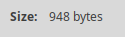
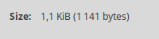

# Размеры файлов
На удивление, в некоторых случаях модифицированнный код занимал больше места, чем оригинальный. Я так подозреваю, что это связано с большим количеством комментариев в коде.
### main
Оригинал 

 После редактирования

